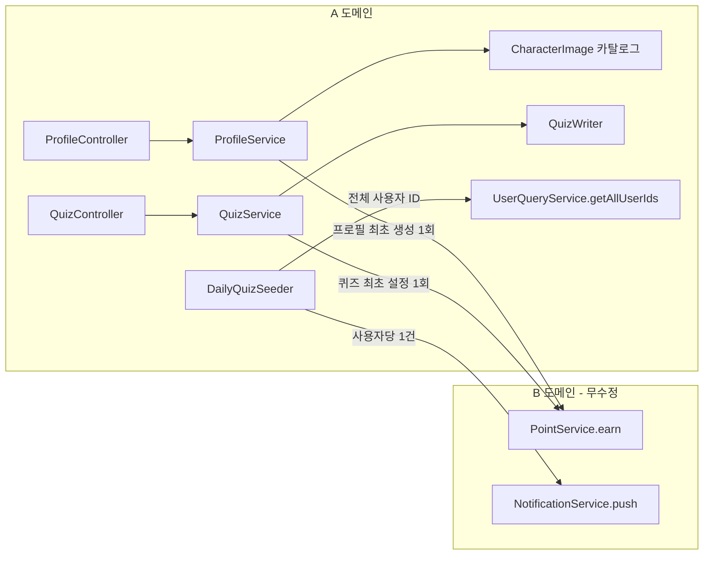

# Design Document

## Overview

A 도메인(`profile`·`quiz`·`daily`·`user`)에 두 갈래의 변경을 가한다.

1. **B 연동(추가만):** 기존 진입점 3곳에 B 도메인(`point`·`notification`) 서비스 호출을 끼워 넣는다. 새 컨트롤러·엔티티·테이블 없음.
2. **A 기능 보강:** 내 퀴즈 삭제(신규 `DELETE /api/quizzes/me`)와 프로필 이미지 설정 방식 변경(기존 multipart 업로드 폐기 → 서버 제공 캐릭터 카탈로그 17종 조회 `GET /api/profiles/characters` + 캐릭터 선택 설정 `PUT /api/profiles/me/image`, 화이트리스트 검증).

B 도메인 코드는 한 줄도 수정하지 않는다. A는 `Long` ID와 B가 제공하는 공개 서비스 시그니처(`PointService.earn`, `NotificationService.push`), 기존 enum 값(`PROFILE_CREATE`·`QUIZ_FIRST_SETUP`·`DAILY_QUIZ`)만 사용한다. "필요한 것만, 바로 개발" 원칙에 따라 변경 파일·메서드 단위로만 설계한다.

### 변경 대상 한눈에 보기

| # | 변경 | 위치(A) | 종류 |
|---|------|---------|------|
| 1 | 프로필 최초 생성 시 +20P | `ProfileService.upsert` 신규 분기 | 호출 추가 |
| 2 | 퀴즈 최초 설정 시 +20P(생애 1회) | `QuizService.saveMyQuiz` | 호출 추가 |
| 3 | 데일리 생성 시 전체 알림 | `DailyQuizSeeder.run` + `UserQueryService` | 호출 추가 + 조회 메서드 |
| 4 | 내 퀴즈 삭제 | `QuizController`/`QuizService`/`QuizWriter` | 신규 엔드포인트 |
| 5 | 캐릭터 카탈로그 조회 | `ProfileController`/`ProfileService` + `CharacterImage` + 응답 DTO | 신규 엔드포인트 |
| 6 | 캐릭터 선택으로 이미지 설정 | `ProfileController`/`ProfileService` + 요청 DTO | 엔드포인트 교체(multipart 폐기) |
| 7 | B 무수정 경계 | 전 구간 | 제약(검증) |
| 8 | 검증용 .http | `http/` | 산출물 |

## 설계 결정 (Design Decisions)

### D1. `PointPort` 대신 `PointService` 직접 호출
`quiz` 도메인에는 이미 `PointPort`(스텁)가 있으나 이는 **`QUIZ_FIRST_SOLVE`(친구 응시)** 전용이다. 그 흐름은 동시 응시 경합이 있어 멱등성을 B의 원장(`refId=ownerId`)에 위임한다.

이번의 `PROFILE_CREATE`·`QUIZ_FIRST_SETUP`는 성격이 다르다. 본인의 단일 행위라 경합이 없고, `refId = null`이라 B의 원장 멱등성(`existsByUserIdAndReasonAndRefId`)을 받지 못한다. "최초 1회" 판별은 전적으로 **호출부(A)** 책임이다. 따라서 두 적립은 사용자 지정 시그니처 그대로 `PointService.earn`을 **직접 호출**한다. 기존 `PointPort`(`QUIZ_FIRST_SOLVE`)는 그대로 둔다. → `PointPort`를 확장하지 않는다(YAGNI, 멱등성 책임 주체가 다름).

적립액은 `point` 도메인의 상수 `PointPolicy.PROFILE_CREATE`(=20)·`PointPolicy.QUIZ_FIRST_SETUP`(=20)을 사용한다. `PointPolicy`는 `@Entity`가 아닌 상수 홀더이므로 경계 규칙(엔티티 import 금지) 위반이 아니며, 매직넘버 `20` 하드코딩을 피한다. (`PointPolicy`에 해당 상수가 없으면 매직넘버 `20` + `// 정책값` 주석으로 대체한다.)

### D2. 전체 사용자 ID 조회는 A 소유 `UserQueryService`에 추가
`UserQueryService`에는 단건/IN 조회만 있고 전체 ID 조회가 없다. `user`는 A 소유이므로 읽기 메서드 `getAllUserIds()`를 추가하고, `UserRepository`에 ID만 select하는 JPQL(`select u.id from User u`)을 둬 엔티티 전체 로딩을 피한다. B 도메인은 건드리지 않는다(요구사항 7.6).

### D3. 알림 발송 실패 격리
개별 `push` 실패가 데일리 생성·다른 사용자 발송을 막지 않아야 한다(요구사항 3.7). 시더에서 사용자별 `push`를 try/catch로 감싸 실패는 로깅 후 계속한다. 데일리 저장은 발송 루프 이전에 이미 영속화되며, 루프의 예외를 삼키므로 트랜잭션 롤백 트리거가 발생하지 않는다.

### D4. 퀴즈 삭제 = "문항·보기 제거 + 퀴즈 비활성화(소프트 삭제)"
퀴즈 행을 물리 삭제하지 않는다. 활성 퀴즈의 문항(`QuizQuestion`)·보기(`QuizOption`)를 기존 `deleteContent` 패턴(보기→문항 벌크 삭제)으로 제거하고, `Quiz.deactivate()`로 `active=false` 전이한다. 이유:
- 응시 기록(`QuizAttempt`/`QuizAnswer`)이 `quizId`를 참조하므로 퀴즈 행을 지우면 기록 정합성이 깨진다. 비활성화는 기록을 보존한다(요구사항 4.9).
- 이후 `GET /api/quizzes/me`(= `getActiveQuiz`, active 조회)가 자연히 `QUIZ_NOT_FOUND`가 된다(요구사항 4.4·4.6).
- **퀴즈 행이 보존되므로 `existsByOwnerId(ownerId)`가 계속 `true`** → `QUIZ_FIRST_SETUP` 생애 1회 적립 근거가 유지된다(요구사항 4.5, 2와 정합).

새 `ErrorCode`는 만들지 않는다 — 활성 퀴즈 부재는 기존 `QUIZ_NOT_FOUND`를 재사용한다.

### D5. 퀴즈 최초 설정 판정은 "레코드 존재 여부"
`QUIZ_FIRST_SETUP`(refId=null)의 "최초" 판정을 "활성 퀴즈 부재"가 아니라 **`quizRepository.existsByOwnerId(ownerId) == false`**(활성·비활성 무관 레코드 존재 여부)로 한다. 소프트 삭제(D4)로 레코드가 보존되므로, 삭제 후 재설정해도 재적립되지 않아 **사용자당 생애 1회**가 보장된다(요구사항 2.2·2.4). `QuizRepository.existsByOwnerId(Long)`를 추가한다.

### D6. 프로필 이미지: multipart 폐기, 서버 카탈로그(17종) 선택 + 화이트리스트 검증
프로필 이미지를 파일 업로드가 아니라 **서버가 고정 제공하는 캐릭터 카탈로그(17종)에서 선택**하는 방식으로 바꾼다(요구사항 5·6).

- 카탈로그는 단일 출처인 **`profile` 도메인의 `CharacterImage` enum**으로 정의한다. 각 상수는 `characterId`(예: `character01`~`character17`)와 `imageUrl`을 가진다. 17종 고정.
- `GET /api/profiles/characters`로 카탈로그 전체(17건: characterId + imageUrl)를 조회한다.
- `PUT /api/profiles/me/image`는 JSON 본문으로 `characterId`를 받아, **카탈로그에 존재하는 유효 식별자만 허용**한다. 무효 식별자는 `BusinessException(ErrorCode.INVALID_INPUT)`(400)로 거절하고 저장하지 않는다(요구사항 6.4). 비어있음/공백은 컨트롤러 `@NotBlank`로 400(요구사항 6.5).
- 유효하면 해당 캐릭터의 **`imageUrl`을 `Profile.imageUrl`에 저장**한다(`GET /me` 응답의 `imageUrl`로 바로 확인 가능, 요구사항 6.2). 저장 형태는 **카탈로그 URL 문자열**로 확정.
- 기존 multipart `POST /api/profiles/me/image`와 `ProfileService.updateImage(MultipartFile)`를 제거한다. 그 결과 `StorageService`/`LocalStorageService`가 미사용이 되는지 먼저 확인하고, 데드코드면 제거(`ProfileService`의 `storageService` 필드·생성자 인자 포함), 다른 사용처가 있으면 보존한다.
- `characterId → imageUrl` 매핑은 `CharacterImage` 한 곳에서만 조회한다(중복 정의 금지).

`INVALID_INPUT`을 재사용하므로 새 `ErrorCode`는 추가하지 않는다.

## Architecture



## Components and Interfaces

### 1. ProfileService (수정 — 적립 연동 + 캐릭터 이미지 설정 + multipart 제거)
`@Value` 때문에 명시적 생성자를 유지한다. `storageService`를 빼고(데드코드 확인 후) `pointService`를 주입한다.

```java
public ProfileService(ProfileRepository profileRepository,
                      UserQueryService userQueryService,
                      PointService pointService,                 // 추가
                      @Value("${app.share.base-url}") String shareBaseUrl) { ... }

@Transactional
public ProfileResponse upsert(Long userId, ProfileRequest request) {
    UserSummary user = userQueryService.getById(userId);
    Profile profile = profileRepository.findByUserId(userId).orElse(null);
    if (profile == null) {
        profile = profileRepository.save(Profile.create(...));
        pointService.earn(userId, PointPolicy.PROFILE_CREATE,
                PointReason.PROFILE_CREATE, null);   // 최초 1회 (요구사항 1.1)
    } else {
        profile.updateBasicInfo(...);                // 갱신: 적립 없음 (요구사항 1.2)
    }
    return ProfileResponse.of(profile, user);
}

// 신규: 캐릭터 카탈로그 조회 (요구사항 5)
public List<CharacterResponse> getCharacters() {
    return CharacterImage.all();   // 고정 17종 (characterId + imageUrl)
}

// 신규: 캐릭터 선택으로 이미지 설정 (요구사항 6)
@Transactional
public ImageResponse setCharacterImage(Long userId, String characterId) {
    CharacterImage character = CharacterImage.findById(characterId)
            .orElseThrow(() -> new BusinessException(ErrorCode.INVALID_INPUT)); // 무효 식별자 400 (6.4)
    Profile profile = getByUserIdOrThrow(userId);   // 없으면 PROFILE_NOT_FOUND (6.6)
    profile.updateImageUrl(character.getImageUrl()); // 카탈로그 URL 저장 (6.2/6.3)
    return new ImageResponse(character.getImageUrl());
}
```
- `upsert`는 이미 `@Transactional` → 저장과 적립이 한 트랜잭션, 어느 하나 실패 시 함께 롤백(요구사항 1.4/1.5).
- 제거: `updateImage(MultipartFile)`, (데드코드면) `storageService` 필드, `import ...multipart.MultipartFile`, `import ...StorageService`.
- 추가 import: `PointService`, `PointReason`, `PointPolicy`(엔티티 import 아님), `CharacterImage`.

### 2. CharacterImage (신규 — 캐릭터 카탈로그 단일 출처)
`profile` 도메인에 고정 17종 카탈로그를 enum으로 정의한다(서버 측 고정 정의, 요구사항 5.4).

```java
public enum CharacterImage {
    CHARACTER_01("character01", "https://cdn.example.com/characters/01.png"),
    // ... character02 ~ character16 ...
    CHARACTER_17("character17", "https://cdn.example.com/characters/17.png");

    private final String characterId;
    private final String imageUrl;
    // 생성자 + getter

    public static List<CharacterResponse> all() {
        return Arrays.stream(values())
                .map(c -> new CharacterResponse(c.characterId, c.imageUrl))
                .toList();   // 정확히 17건 (요구사항 5.2)
    }

    public static Optional<CharacterImage> findById(String characterId) {
        return Arrays.stream(values())
                .filter(c -> c.characterId.equals(characterId))
                .findFirst();
    }
}
```
- 실제 이미지 URL은 프론트 에셋 경로에 맞춰 채운다(17개). 식별자는 안정적 키(`character01`~`character17`).

### 3. DTO (신규)
```java
// 카탈로그 응답 항목 (요구사항 5.3)
public record CharacterResponse(
        @Schema(description = "캐릭터 식별자", example = "character07") String characterId,
        @Schema(description = "캐릭터 이미지 URL", example = "https://cdn.example.com/characters/07.png") String imageUrl) {
}

// 캐릭터 선택 요청 (요구사항 6.1/6.5)
public record ProfileImageRequest(
        @Schema(description = "선택한 캐릭터 식별자", example = "character07")
        @NotBlank String characterId) {
}
```
- `@NotBlank`로 공백뿐인 값 차단 → 400 `INVALID_INPUT`(요구사항 6.5). 카탈로그 존재 여부 검증은 서비스에서 수행(6.4).

### 4. ProfileController (수정 — 카탈로그 조회 추가 + 이미지 엔드포인트 교체)
multipart 메서드를 제거하고, 카탈로그 조회와 캐릭터 선택 설정을 추가한다.

```java
@Operation(summary = "캐릭터 카탈로그 조회", description = "프로필 이미지로 선택 가능한 캐릭터 17종을 반환한다.")
@GetMapping("/characters")
public ApiResponse<List<CharacterResponse>> getCharacters(
        @AuthenticationPrincipal CustomUserDetails user) {
    return ApiResponse.ok(profileService.getCharacters());   // 요구사항 5
}

@Operation(summary = "프로필 이미지(캐릭터) 설정",
        description = "카탈로그의 캐릭터 식별자로 프로필 이미지를 설정한다. 무효 식별자는 400, 프로필 없으면 404.")
@PutMapping("/me/image")
public ApiResponse<ImageResponse> setImage(
        @AuthenticationPrincipal CustomUserDetails user,
        @Valid @RequestBody ProfileImageRequest request) {
    return ApiResponse.ok(profileService.setCharacterImage(user.getUserId(), request.characterId()));
}
```
- 제거: 기존 `POST /me/image`(consumes multipart) 메서드와 `MultipartFile`·`RequestPart`·`MediaType` import.
- 미인증은 SecurityFilterChain이 401 처리(요구사항 5.6/6.8).

### 5. QuizService (수정 — 적립 연동 + 삭제 메서드)
`@RequiredArgsConstructor`이므로 `private final PointService pointService;` 필드만 추가한다(`PointPort`는 유지).

```java
@Transactional
public QuizResponse saveMyQuiz(Long ownerId, QuizSaveRequest request) {
    boolean firstSetup = !quizRepository.existsByOwnerId(ownerId); // 레코드 존재 여부로 판정 (요구사항 2.2, D5)
    QuizDraft draft = toDraft(request);
    validator.validate(draft);
    Quiz quiz = quizWriter.replaceActiveContent(ownerId, draft);
    if (firstSetup) {
        pointService.earn(ownerId, PointPolicy.QUIZ_FIRST_SETUP,
                PointReason.QUIZ_FIRST_SETUP, null);  // 생애 1회 (요구사항 2.1)
    }
    return assemble(quiz.getId());
}

// 신규: 내 활성 퀴즈 삭제 (요구사항 4)
@Transactional
public void deleteMyQuiz(Long ownerId) {
    Quiz quiz = quizRepository.findFirstByOwnerIdAndActiveTrueOrderByIdDesc(ownerId)
            .orElseThrow(() -> new BusinessException(ErrorCode.QUIZ_NOT_FOUND)); // 4.6, 본인 active 한정(4.8)
    quizWriter.clearContentAndDeactivate(quiz);   // 문항·보기 제거 + active=false (레코드 보존)
}
```
- `saveMyQuiz`는 이미 `@Transactional` → 저장·적립 원자성(요구사항 2.6/2.7). `existsByOwnerId`로 판정하므로 재저장·삭제후 재설정 시 미적립(요구사항 2.3/2.4).
- 추가 import: `PointService`, `PointReason`, `PointPolicy`.

### 6. QuizRepository (수정 — 존재 여부 조회 추가)
```java
boolean existsByOwnerId(Long ownerId);   // 생애 1회 적립 판정 (요구사항 2.2/7.6)
```

### 7. QuizWriter (수정 — 삭제용 public 메서드)
기존 private `deleteContent`(보기→문항 벌크 삭제)를 재사용한다.

```java
/** 활성 퀴즈의 문항·보기 제거 후 비활성화. 호출부 트랜잭션에 합류(REQUIRED). 퀴즈 행은 보존. */
public void clearContentAndDeactivate(Quiz quiz) {
    deleteContent(quiz.getId());   // 요구사항 4.3 (기존 벌크 삭제 패턴 재사용)
    quiz.deactivate();             // 요구사항 4.2 (active=false 전이, dirty checking)
}
```
- `QuizWriter`는 `@Transactional`(REQUIRED) → `deleteMyQuiz`의 트랜잭션에 합류(요구사항 4.7). `quiz`는 영속 엔티티라 `deactivate()`가 같은 트랜잭션에서 반영. 퀴즈 행 자체는 남으므로 `existsByOwnerId`는 계속 `true`(요구사항 4.5). 응시 기록은 손대지 않으므로 보존(요구사항 4.9).

### 8. QuizController (수정 — 삭제 엔드포인트 추가)
```java
@Operation(summary = "내 퀴즈 삭제",
        description = "내 활성 퀴즈의 문항·보기를 제거하고 비활성화한다. 활성 퀴즈가 없으면 404(QUIZ_NOT_FOUND).")
@DeleteMapping("/me")
public ApiResponse<Void> deleteMine(@AuthenticationPrincipal CustomUserDetails user) {
    quizService.deleteMyQuiz(user.getUserId());   // 본인(userId) 한정 (요구사항 4.1/4.8)
    return ApiResponse.ok();                        // 성공 래핑 (요구사항 4.10)
}
```
- 추가 import: `org.springframework.web.bind.annotation.DeleteMapping`. 미인증은 SecurityFilterChain이 401(요구사항 4.11).

### 9. DailyQuizSeeder (수정 — 신규 생성 시 전체 알림)
`UserQueryService`·`NotificationService`를 주입한다. 신규 저장이 일어난 경우에만 발송한다.

```java
@Override
@Transactional
public void run(ApplicationArguments args) {
    LocalDate today = LocalDate.now(ZONE);
    if (dailyQuizRepository.findByQuizDate(today).isPresent()) {
        return;   // 이미 존재 → 발송 0건 (요구사항 3.5)
    }
    String[] pick = POOL.get((int) Math.floorMod(today.toEpochDay(), POOL.size()));
    DailyQuiz saved = dailyQuizRepository.save(DailyQuiz.create(today, pick[0], pick[1], pick[2]));
    notifyAllUsers(saved.getId());
    log.info("오늘의 데일리 시드 적재: {} ({} vs {})", pick[0], pick[1], pick[2]);
}

private void notifyAllUsers(Long dailyQuizId) {
    for (Long userId : userQueryService.getAllUserIds()) {   // N=0이면 0건 (요구사항 3.6)
        try {
            notificationService.push(userId, NotificationType.DAILY_QUIZ,
                    "오늘의 퀴즈가 생성되었습니다!", "지금 바로 풀어보세요!", dailyQuizId); // 요구사항 3.2
        } catch (Exception e) {
            log.warn("데일리 퀴즈 알림 발송 실패 userId={}", userId, e);  // 계속 진행, 롤백 안 함 (요구사항 3.7)
        }
    }
}
```
- 추가 import: `NotificationService`, `NotificationType`, `UserQueryService`.
- 트랜잭션 경계: `push`(NotificationService의 `@Transactional`)가 시더 `run()` 트랜잭션에 합류하지만, 개별 실패를 try/catch로 삼켜 예외가 전파되지 않으므로 데일리 저장은 롤백되지 않는다(요구사항 3.7). 시연 규모에서 충분하며 별도 트랜잭션 분리는 두지 않는다(YAGNI).

### 10. UserQueryService / UserRepository (수정 — user 도메인, A 소유)
```java
// UserQueryService
public List<Long> getAllUserIds() {
    return userRepository.findAllUserIds();
}

// UserRepository
@Query("select u.id from User u")
List<Long> findAllUserIds();
```

### 11. Profile (엔티티 — 컬럼 길이 조정)
카탈로그 이미지 URL을 저장하므로 `image_url` 길이를 넓힌다(현재 기본 255 → 512). 그 외 변경 없음.

```java
@Column(name = "image_url", length = 512)
private String imageUrl;
```

## Data Models

신규 테이블·엔티티·컬럼 변경 없음(길이 조정만).
- `point_transactions`·`notifications`: B 서비스가 행을 추가할 뿐(A는 스키마 무관).
- `quizzes`: 삭제는 `is_active`를 `false`로 갱신할 뿐(행/컬럼 변화 없음). `quiz_questions`·`quiz_options`: 기존 벌크 삭제로 행 제거.
- `profiles.image_url`: 카탈로그 캐릭터 URL(최대 512자) 저장. `@Column(length = 512)`로 조정.
- 캐릭터 카탈로그는 DB가 아니라 `CharacterImage` enum의 서버 측 고정 정의다(테이블 없음).

## Correctness Properties

*속성(property)이란 시스템의 모든 유효한 실행에 걸쳐 참이어야 하는 특성 또는 동작으로, 시스템이 무엇을 해야 하는지에 대한 형식적 진술이다. 속성은 사람이 읽는 명세와 기계가 검증 가능한 정확성 보장 사이의 다리 역할을 한다.*

본 기능의 핵심 로직은 "특정 시점에 B 서비스를 정확한 횟수·인자로 호출"하는 것과 "삭제·캐릭터 설정의 상태 효과/검증"이다. 따라서 mock 기반 호출 검증과 상태 전이·검증 속성이 PBT에 적합하다. 트랜잭션 경계·아키텍처 제약(엔티티 import 금지)·미인증 401·.http 산출물은 PBT 대상이 아니며 Testing Strategy에서 단위/예시/수동 검증으로 다룬다.

### Property 1: 프로필 최초 생성 1회 적립

*임의의* 사용자와 임의의 프로필 요청 시퀀스에 대해, 프로필 부재 상태에서 `upsert`를 N회(N≥1) 호출하면 `PointService.earn(userId, PointPolicy.PROFILE_CREATE, PointReason.PROFILE_CREATE, null)` 호출은 정확히 1회(첫 호출, 신규 생성 분기)이며, 이후 갱신 호출에서는 0회다.

**Validates: Requirements 1.1, 1.2, 1.3**

### Property 2: 퀴즈 최초 설정 생애 1회 적립

*임의의* 사용자와 임의의 퀴즈 저장 요청 시퀀스에 대해, `existsByOwnerId`가 `false`인 최초 상태에서 `saveMyQuiz`를 N회(N≥1) 호출하면 `PointService.earn(ownerId, PointPolicy.QUIZ_FIRST_SETUP, PointReason.QUIZ_FIRST_SETUP, null)` 호출은 정확히 1회이며, 이미 레코드가 있는 재저장·삭제 후 재설정에서는 0회다.

**Validates: Requirements 2.1, 2.2, 2.3, 2.4, 2.5**

### Property 3: 데일리 알림 팬아웃 정확성

*임의의* 사용자 ID 목록(크기 N≥0)에 대해, 오늘 데일리가 신규 생성되면 `NotificationService.push` 호출은 정확히 N건이며(중복 0·누락 0), 각 호출 인자는 `(해당 userId, NotificationType.DAILY_QUIZ, "오늘의 퀴즈가 생성되었습니다!", "지금 바로 풀어보세요!", dailyQuizId)`다. N=0이면 0건으로 정상 종료한다.

**Validates: Requirements 3.1, 3.2, 3.3, 3.6**

### Property 4: 재실행 무발송

*임의의* 실행에서 오늘 날짜의 데일리가 이미 존재하면, 데일리 저장은 일어나지 않고 `NotificationService.push` 호출은 0건이다.

**Validates: Requirements 3.5**

### Property 5: 발송 실패 격리

*임의의* 사용자 ID 목록과 그 중 임의의 부분집합에서 `push`가 예외를 던져도, 시더는 목록 전체에 대해 `push` 호출을 시도하며(나머지 사용자 발송 계속), 예외를 호출자에게 전파하지 않아 데일리 저장이 롤백되지 않는다.

**Validates: Requirements 3.7**

### Property 6: 퀴즈 삭제 효과

*임의의* 사용자와 임의의 문항·보기 구성을 가진 활성 퀴즈에 대해, `deleteMyQuiz(ownerId)` 후 해당 사용자의 활성 퀴즈 조회는 `QUIZ_NOT_FOUND`가 되고(문항·보기 제거 + `active=false`), 다른 사용자의 활성 퀴즈는 영향받지 않는다.

**Validates: Requirements 4.2, 4.4, 4.8**

### Property 7: 퀴즈 삭제 후 레코드·응시 기록 보존

*임의의* 활성 퀴즈와 그에 대한 임의의 응시 기록(`QuizAttempt`·`QuizAnswer`) 집합에 대해, `deleteMyQuiz` 수행 후에도 퀴즈 레코드(`existsByOwnerId == true`)와 응시 기록은 삭제되지 않고 보존된다.

**Validates: Requirements 4.5, 4.9**

### Property 8: 캐릭터 카탈로그 고정성

*임의의* 카탈로그 조회 호출에 대해, 반환되는 캐릭터는 정확히 17건이며 각 항목은 `(characterId, imageUrl)`을 갖고, 동일 식별자 집합이 항상 동일하게 반환된다.

**Validates: Requirements 5.2, 5.3, 5.4**

### Property 9: 캐릭터 선택 설정의 유효성 분기

*임의의* 입력 식별자에 대해, 카탈로그(17종)에 존재하는 식별자이면 `Profile.imageUrl`이 그 캐릭터의 `imageUrl`로 설정되고 응답에 동일 값이 반환되며, 카탈로그에 없는 식별자이면 `BusinessException(INVALID_INPUT)`(400)으로 거절되고 `Profile.imageUrl`은 변경되지 않는다.

**Validates: Requirements 6.2, 6.3, 6.4**

## Error Handling

| 상황 | 처리 | 요구사항 |
|------|------|----------|
| 프로필 저장 또는 `earn` 실패 | `upsert` 단일 트랜잭션 롤백, 오류 전파 | 1.4, 1.5 |
| 퀴즈 저장 또는 `earn` 실패 | `saveMyQuiz` 단일 트랜잭션 롤백, 오류 전파 | 2.6, 2.7 |
| 개별 `push` 실패 | 로깅 후 다음 사용자 계속, 데일리 롤백 안 함 | 3.7 |
| 사용자 0명 | 발송 0건, 정상 종료 | 3.6 |
| 삭제 시 활성 퀴즈 없음 | `BusinessException(QUIZ_NOT_FOUND)` (404) | 4.6 |
| 삭제 중 실패 | `deleteMyQuiz` 단일 트랜잭션 롤백, 활성 퀴즈 상태 보존 | 4.7 |
| 무효 캐릭터 식별자 | `BusinessException(INVALID_INPUT)` (400), 미변경 | 6.4 |
| 캐릭터 식별자 빈/공백 | 컨트롤러 `@NotBlank` → 400 `INVALID_INPUT`, 미변경 | 6.5 |
| 이미지 설정 시 프로필 없음 | `BusinessException(PROFILE_NOT_FOUND)` (404) | 6.6 |
| 미인증 요청(삭제/카탈로그/이미지) | SecurityFilterChain 401, 상태 미변경 | 4.11, 5.6, 6.8 |

새 `ErrorCode`는 추가하지 않는다(기존 `QUIZ_NOT_FOUND`·`PROFILE_NOT_FOUND`·`INVALID_INPUT` 재사용).

## Testing Strategy

### 단위/모의(Mockito) 테스트
- `ProfileServiceTest`: 신규 생성 시 `earn` 1회(인자 검증), 갱신 시 0회; `earn` 예외 시 전파(1.5); `getCharacters` 17건 반환; `setCharacterImage` 유효 식별자 저장·반환, 무효 식별자 `INVALID_INPUT`(6.4), 프로필 부재 시 `PROFILE_NOT_FOUND`(6.6).
- `QuizServiceTest`: 최초(`existsByOwnerId=false`) `saveMyQuiz` 시 `earn` 1회, 레코드 존재 시 0회; 삭제 후 재설정 시 0회(2.4); `deleteMyQuiz` 정상/`QUIZ_NOT_FOUND`(4.6); `clearContentAndDeactivate` 위임 검증.
- `DailyQuizSeederTest`: N명 → N건(인자), 이미 존재 시 save·push 0건(3.5), 일부 `push` 예외 시 나머지 호출·예외 비전파(3.7), `getAllUserIds` 호출 검증(3.4).
- 컨트롤러 슬라이스(`@WebMvcTest`): `DELETE /me` 매핑·`ApiResponse.ok`(4.1/4.10), `GET /characters` 17건(5), `PUT /me/image` `@NotBlank` 400(6.5)·무효 식별자 400(6.4), 미인증 401(4.11/5.6/6.8).

### 속성 기반 테스트(PBT)
- 라이브러리: **jqwik**(JUnit 5 연동, 신규 의존성 추가 — Java 21/Gradle 표준 선택). 직접 구현하지 않는다.
- 각 속성 테스트는 **최소 100회** 반복 실행하도록 구성한다.
- 각 테스트에 설계 속성 참조 주석을 단다. 형식: `// Feature: point-notification-integration, Property {번호}: {속성 텍스트}`.
- 속성당 단일 PBT로 구현: P1·P2(반복 호출 횟수), P3(사용자 수 N 팬아웃, N=0 포함), P4(이미 존재 상태), P5(임의 실패 부분집합), P6·P7(임의 문항·응시 구성), P8(카탈로그 고정), P9(유효/무효 식별자 분기). B 서비스·리포지토리는 mock으로 대체해 비용을 낮춘다.

> jqwik 의존성은 `build.gradle`의 `testImplementation`에 추가한다(B 도메인·운영 코드와 무관). 추가가 불가하면 JUnit5 파라미터라이즈드 + 난수 생성으로 동등하게 100회 반복을 구성한다.

### 수동 검증(.http)
`http/point-notification.http`(신규)에 기존 컨벤션(`@baseUrl`, `# @name login`, `Authorization: Bearer {{login.response.body.$.data.accessToken}}`, `###` 구분)을 따라 다음 흐름을 배치한다(요구사항 8):
1. 로그인 → 프로필 생성 → `GET /api/points/balance` → `GET /api/points/transactions`(`PROFILE_CREATE` 확인)
2. 퀴즈 설정 → 포인트 잔액/내역(`QUIZ_FIRST_SETUP` 확인)
3. 데일리 생성 이후 → `GET /api/notifications`(`DAILY_QUIZ` 확인)
4. `DELETE /api/quizzes/me` → `GET /api/quizzes/me`(`QUIZ_NOT_FOUND` 확인)
5. `GET /api/profiles/characters`(17종) → 고른 식별자로 `PUT /api/profiles/me/image` → `GET /api/profiles/me`(`imageUrl` 확인)
6. 카탈로그에 없는 식별자로 `PUT /api/profiles/me/image`(400 확인)

### 빌드 점검
`./gradlew compileJava`로 컴파일 확인 후 `./gradlew test`. (`contextLoads`·통합은 MySQL 필요 — 단위/PBT는 mock으로 DB 불필요.)
